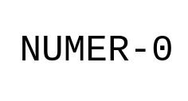

<i><b>README</b></i>
 

<a><i>Table Of Contents</i></a>  <ul>
<a href="#INTRODUCTION" style="margin-left:0px;">INTRODUCTION</a>
 
<a href="#int_to_binarydq" style="margin-left:20px;">int_to_binarydq</a>
 
<a href="#binarydq_to_int" style="margin-left:20px;">binarydq_to_int</a>
 
<a href="#binarydq2_to_int" style="margin-left:20px;">binarydq2_to_int</a>
 
<a href="#FloatStore" style="margin-left:20px;">FloatStore</a>
 
<a href="#IEEE754ToFloat" style="margin-left:20px;">IEEE754ToFloat</a>
 
<a href="#FloatToIEEE754" style="margin-left:20px;">FloatToIEEE754</a>
 
<a href="#ByteToBinaryFloat" style="margin-left:20px;">ByteToBinaryFloat</a>
 
<a href="#AreEqualFloat" style="margin-left:20px;">AreEqualFloat</a>
 
<a href="#IsSuperiorFloat" style="margin-left:20px;">IsSuperiorFloat</a>
 
<a href="#DoubleStore" style="margin-left:20px;">DoubleStore</a>
 
<a href="#IEEE754ToDouble" style="margin-left:20px;">IEEE754ToDouble</a>
 
<a href="#DoubleToIEEE754" style="margin-left:20px;">DoubleToIEEE754</a>
 
<a href="#ByteToBinaryDouble" style="margin-left:20px;">ByteToBinaryDouble</a>
 
<a href="#AreEqualDouble" style="margin-left:20px;">AreEqualDouble</a>
 
<a href="#IsSuperiorDouble" style="margin-left:20px;">IsSuperiorDouble</a>
 
<a href="#FloatToIntBinary" style="margin-left:20px;">FloatToIntBinary</a>
 
<a href="#DoubleToIntBinary" style="margin-left:20px;">DoubleToIntBinary</a>
 
<a href="#IntStore" style="margin-left:20px;">IntStore</a>
 
<a href="#IntToFloatBinary" style="margin-left:20px;">IntToFloatBinary</a>
 
<a href="#IntToDoubleBinary" style="margin-left:20px;">IntToDoubleBinary</a>
 
<a href="#FloatToDoubleBinary" style="margin-left:20px;">FloatToDoubleBinary</a>
 
<a href="#DoubleToFloatBinary" style="margin-left:20px;">DoubleToFloatBinary</a>
 
<a href="#ShortIntStore" style="margin-left:20px;">ShortIntStore</a>
 
<a href="#LongIntStore" style="margin-left:20px;">LongIntStore</a>
 
<a href="#IntToShortIntBinary" style="margin-left:20px;">IntToShortIntBinary</a>
 
<a href="#IntToLongIntBinary" style="margin-left:20px;">IntToLongIntBinary</a>
 
<a href="#LongIntToIntBinary" style="margin-left:20px;">LongIntToIntBinary</a>
 
<a href="#LongIntToShortIntBinary" style="margin-left:20px;">LongIntToShortIntBinary</a>
 
<a href="#ShortIntToIntBinary" style="margin-left:20px;">ShortIntToIntBinary</a>
 
<a href="#ShortIntToLongIntBinary" style="margin-left:20px;">ShortIntToLongIntBinary</a>
 
<a href="#ByteToBinaryInt" style="margin-left:20px;">ByteToBinaryInt</a>
 
<a href="#ByteToBinaryShortInt" style="margin-left:20px;">ByteToBinaryShortInt</a>
 
<a href="#ByteToBinaryLongInt" style="margin-left:20px;">ByteToBinaryLongInt</a>
 
<a href="#FlippBinaryNegativeInt" style="margin-left:20px;">FlippBinaryNegativeInt</a>
 
<a href="#ReverseFlippBinaryNegativeInt" style="margin-left:20px;">ReverseFlippBinaryNegativeInt</a>
 
<a href="#IntSameTypeAddition" style="margin-left:20px;">IntSameTypeAddition</a>
 
<a href="#IntSameTypeSubstraction" style="margin-left:20px;">IntSameTypeSubstraction</a>
 
<a href="#BinaryToByteInt" style="margin-left:20px;">BinaryToByteInt</a>
 
<a href="#BinaryToByteShortInt" style="margin-left:20px;">BinaryToByteShortInt</a>
 
<a href="#BinaryToByteLongInt" style="margin-left:20px;">BinaryToByteLongInt</a>
 
<a href="#BinaryToByteDouble" style="margin-left:20px;">BinaryToByteDouble</a>
 
<a href="#BinaryToByteFloat" style="margin-left:20px;">BinaryToByteFloat</a>
 
<a href="#AbstractionIntSameTypeAddition" style="margin-left:20px;">AbstractionIntSameTypeAddition</a>
 
<a href="#AbstractionIntSameTypeSubstraction" style="margin-left:20px;">AbstractionIntSameTypeSubstraction</a>
 
<a href="#IEEE754DoubleToDoubleAddition" style="margin-left:20px;">IEEE754DoubleToDoubleAddition</a>
 
<a href="#IEEE754DoubleToDoubleSubstraction" style="margin-left:20px;">IEEE754DoubleToDoubleSubstraction</a>
 
<a href="#IEEE754FloatToFloatAddition" style="margin-left:20px;">IEEE754FloatToFloatAddition</a>
 
<a href="#IEEE754FloatToFloatSubstraction" style="margin-left:20px;">IEEE754FloatToFloatSubstraction</a>
 
</ul> 

 
<h1 style="color: #2c4786;"><b id="INTRODUCTION">INTRODUCTION:</b></h1>

C++ library addition and substraction of signed int, float and double at binary level
<h2 id="int_to_binarydq" style="test-align: left;">int_to_binarydq</h2>
<h3>#Usage</h3>

<code>std::deque&lt;bool&gt; int_to_binarydq(unsigned int x)</code>

<h3>#Description</h3>

Converts an unsigned int to a binary format as a boolean deque

<h3>#Arguments</h3>
<table><tr><th>Name</th><th>Definition</th></tr><tr><th>
x </th><th> is the input unsigned int</th></tr>
</table>
 
<h3>#Example(s)</h3>

<code>std::deque&lt;bool&gt; rtn_dq  = int_to_binarydq(1286);</code>
 <code>1 0 1 0 0 0 0 0 1 1 0</code>

 

<h2 id="binarydq_to_int" style="test-align: left;">binarydq_to_int</h2>
<h3>#Usage</h3>

<code>unsigned int binarydq_to_int(std::deque&lt;bool&gt; &x)</code>

<h3>#Description</h3>

Converts a binary format as a boolean deque to an unsigned int

<h3>#Arguments</h3>
<table><tr><th>Name</th><th>Definition</th></tr><tr><th>
x </th><th> is the input boolean std deque</th></tr>
</table>
 
<h3>#Example(s)</h3>

<code>std::deque&lt;bool&gt; dq_input = {1, 0, 1, 0, 0, 0, 0, 0, 1, 1, 0};</code>
 <code>unsigned int out = binarydq_to_int(rtn_dq);</code>
 <code>1286</code>

 

<h2 id="binarydq2_to_int" style="test-align: left;">binarydq2_to_int</h2>
<h3>#Usage</h3>

<code>unsigned int binarydq2_to_int(std::deque&lt;bool&gt; &x)</code>

<h3>#Description</h3>

Converts a binary format as a boolean deque to an unsigned int, contrary to <code>binarydq_to_int()</code> it does not try to emulate an int (from binary) which increase a lot its speed.

<h3>#Arguments</h3>
<table><tr><th>Name</th><th>Definition</th></tr><tr><th>
x </th><th> is the input boolean std deque</th></tr>
</table>
 
<h3>#Example(s)</h3>

<code>std::deque&lt;bool&gt; dq_input = {1, 0, 1, 0, 0, 0, 0, 0, 1, 1, 0};</code>
 <code>unsigned int out = binarydq2_to_int(rtn_dq);</code>
 <code>1286</code>

 

<h2 id="FloatStore" style="test-align: left;">FloatStore</h2>
<h3>#Usage</h3>

<code>union FloatStore {   float value;   unsigned char byte_rep[sizeof(float)]; };</code>

<h3>#Description</h3>

A simple union for a float representation and its byte representation according to the IEEE754 standard

<h3>#Arguments</h3>
<table><tr><th>Name</th><th>Definition</th></tr><tr><th>
no args </th><th> no def</th></tr>
</table>
 
<h3>#Example(s)</h3>

<code>float x = 43.13;</code>
 <code>FloatStore obj1;</code>
 <code>obj1.value = x;</code>

 

<h2 id="IEEE754ToFloat" style="test-align: left;">IEEE754ToFloat</h2>
<h3>#Usage</h3>

<code>float IEEE754ToFloat(std::deque&lt;bool&gt; &binary_rep)</code>

<h3>#Description</h3>

Converts a IEE754 standardized binary representation of a single value precision decimal to a float.

<h3>#Arguments</h3>
<table><tr><th>Name</th><th>Definition</th></tr><tr><th>
x </th><th> is the input binary representation</th></tr>
</table>
 
<h3>#Example(s)</h3>

<code>int i;</code>
 <code>//Store float to memory and get its byte representation</code>
 <code>float x = 43.13;</code>
 <code>FloatStore obj1;</code>
 <code>obj1.value = x;</code>
 <code>unsigned char byte_rep[sizeof(float)];</code>
 <code>memcpy(byte_rep, obj1.byte_rep, sizeof(float));</code>
 <code>////</code>
 <code>//Convert to binary format, default to IEEE754</code>
 <code>std::deque&lt;bool&gt; binary_rep = ByteToBinaryFloat(byte_rep);</code>
 <code>i = 0;</code>
 <code>while (i &lt; binary_rep.size()) {</code>
 <code>  std::cout &lt;&lt; binary_rep[i];</code>
 <code>  i += 1;</code>
 <code>};</code>
 <code>std::cout &lt;&lt; "\n";</code>
 <code>////</code>
 <code>//Convert binary representation (IEEE754) to double</code>
 <code>float rslt = IEEE754ToFloat(binary_rep);</code>
 <code>std::cout &lt;&lt; std::setprecision(9);</code>
 <code>std::cout &lt;&lt; rslt &lt;&lt; "\n";</code>

 

<h2 id="FloatToIEEE754" style="test-align: left;">FloatToIEEE754</h2>
<h3>#Usage</h3>

<code>std::deque&lt;bool&gt; FloatToIEEE754(float &x)</code>

<h3>#Description</h3>

Converts a float to a boolean <code>std::deque</code> representing its binary representation according to the IEEE754 standard for single value precison.

<h3>#Arguments</h3>
<table><tr><th>Name</th><th>Definition</th></tr><tr><th>
x </th><th> is the input float</th></tr>
</table>
 
<h3>#Example(s)</h3>

<code>float rslt = 833.726;</code>
 <code>std::deque&lt;bool&gt; binary_rep = FloatToIEEE754(rslt);</code>
 <code>int i = 0;</code>
 <code>while (i &lt; binary_rep.size()) {</code>
 <code>  std::cout &lt;&lt; binary_rep[i];</code>
 <code>  i += 1;</code>
 <code>};</code>
 <code>std::cout &lt;&lt; "\n";</code>
 <code>01000100010100000110111001110110</code>

 

<h2 id="ByteToBinaryFloat" style="test-align: left;">ByteToBinaryFloat</h2>
<h3>#Usage</h3>

<code>std:deque&lt;bool&gt; ByteToBinaryFloat(unsigned char (&byte_rep)[sizeof(float)])</code>

<h3>#Description</h3>

Converts a byte representation of a float to its binary representation

<h3>#Arguments</h3>
<table><tr><th>Name</th><th>Definition</th></tr><tr><th>
x </th><th> is the input byte array (little endian encoding assumed)</th></tr>
</table>
 
<h3>#Example(s)</h3>

<code>float x = 43.13;</code>
 <code>FloatStore obj1;</code>
 <code>obj1.value = x;</code>
 <code>unsigned char byte_rep[sizeof(float)];</code>
 <code>memcpy(byte_rep, obj1.byte_rep, sizeof(float));</code>
 <code>std::deque&lt;bool&gt; binary_rep = ByteToBinaryFloat(byte_rep);</code>
 <code>i = 0;</code>
 <code>while (i &lt; binary_rep.size()) {</code>
 <code>  std::cout &lt;&lt; binary_rep[i];</code>
 <code>  i += 1;</code>
 <code>};</code>
 <code>std::cout &lt;&lt; "\n";</code>
 <code>01000010001011001000010100011111</code>

 

<h2 id="AreEqualFloat" style="test-align: left;">AreEqualFloat</h2>
<h3>#Usage</h3>

<code>bool AreEqualFloat(std::deque&lt;bool&gt; &x, std::deque&lt;bool&gt; &x2)</code>

<h3>#Description</h3>

Returns a boolean, if the binary (IEEE754) representation of 2 differents float are equal it will return 1, 0 either.

<h3>#Arguments</h3>
<table><tr><th>Name</th><th>Definition</th></tr><tr><th>
x </th><th> is the first IEEE754 binary representation of a float, the first double</th></tr>
<tr><th>x </th><th> is the second IEEE754 binary representation of a float, the second double</th></tr>
</table>
 
<h3>#Example(s)</h3>

<code>//Store double to memory and get its byte representation</code>
 <code>float x = 43232.1813;</code>
 <code>FloatStore obj1;</code>
 <code>obj1.value = x;</code>
 <code>unsigned char byte_rep[sizeof(float)];</code>
 <code>memcpy(byte_rep, obj1.byte_rep, sizeof(float));</code>
 <code>std::deque&lt;bool&gt; bit_rep = ByteToBinaryFloat(byte_rep);</code>
 <code>float x2 = 123232.112;</code>
 <code>FloatStore obj2;</code>
 <code>obj2.value = x2;</code>
 <code>unsigned char byte_rep2[sizeof(float)];</code>
 <code>memcpy(byte_rep2, obj2.byte_rep, sizeof(float));</code>
 <code>std::deque&lt;bool&gt; bit_rep2 = ByteToBinaryFloat(byte_rep2);</code>
 <code>int i = 0;</code>
 <code>while (i &lt; bit_rep.size()) {</code>
 <code>  std::cout &lt;&lt; bit_rep[i];</code>
 <code>  i += 1;</code>
 <code>};</code>
 <code>std::cout &lt;&lt; "\n";</code>
 <code>i = 0;</code>
 <code>while (i &lt; bit_rep2.size()) {</code>
 <code>  std::cout &lt;&lt; bit_rep2[i];</code>
 <code>  i += 1;</code>
 <code>};</code>
 <code>std::cout &lt;&lt; "\n";</code>
 <code>////</code>
 <code>bool test = AreEqualFloat(bit_rep, bit_rep2);</code>
 <code>std::cout &lt;&lt; test &lt;&lt; "\n";</code>

 

<h2 id="IsSuperiorFloat" style="test-align: left;">IsSuperiorFloat</h2>
<h3>#Usage</h3>

<code>bool IsSuperiorFloat(std::deque&lt;bool&gt; &x1, std::deque&lt;bool&gt; &x2)</code>

<h3>#Arguments</h3>
<table><tr><th>Name</th><th>Definition</th></tr><tr><th>
x </th><th> is the first IEEE754 binary representation of a float, the first float</th></tr>
<tr><th>x </th><th> is the second IEEE754 binary representation of a float, the second float</th></tr>
</table>
 
<h3>#Example(s)</h3>

<code>//Store double to memory and get its byte representation</code>
 <code>float x = 43232.1813;</code>
 <code>FloatStore obj1;</code>
 <code>obj1.value = x;</code>
 <code>unsigned char byte_rep[sizeof(float)];</code>
 <code>memcpy(byte_rep, obj1.byte_rep, sizeof(float));</code>
 <code>std::deque&lt;bool&gt; bit_rep = ByteToBinaryDouble(byte_rep);</code>
 <code>float x2 = 23232.18;</code>
 <code>FoatStore obj2;</code>
 <code>obj2.value = x2;</code>
 <code>unsigned char byte_rep2[sizeof(float)];</code>
 <code>memcpy(byte_rep2, obj2.byte_rep, sizeof(float));</code>
 <code>std::deque&lt;bool&gt; bit_rep2 = ByteToBinaryDouble(byte_rep2);</code>
 <code>int i = 0;</code>
 <code>while (i &lt; bit_rep.size()) {</code>
 <code>  std::cout &lt;&lt; bit_rep[i];</code>
 <code>  i += 1;</code>
 <code>};</code>
 <code>std::cout &lt;&lt; "\n";</code>
 <code>i = 0;</code>
 <code>while (i &lt; bit_rep2.size()) {</code>
 <code>  std::cout &lt;&lt; bit_rep2[i];</code>
 <code>  i += 1;</code>
 <code>};</code>
 <code>std::cout &lt;&lt; "\n";</code>
 <code>////</code>
 <code>bool test = IsSuperiorFloat(bit_rep, bit_rep2);</code>
 <code>std::cout &lt;&lt; test &lt;&lt; "\n";</code>
 <code>1</code>

 

<h2 id="DoubleStore" style="test-align: left;">DoubleStore</h2>
<h3>#Usage</h3>

<code>union DoubleStore {   double value;   unsigned char byte_rep[sizeof(double)]; };</code>

<h3>#Description</h3>

A simple union for a double representation and its byte representation according to the IEEE754 standard

<h3>#Arguments</h3>
<table><tr><th>Name</th><th>Definition</th></tr><tr><th>
no args </th><th> no def</th></tr>
</table>
 
<h3>#Example(s)</h3>

<code>double x = 43.13;</code>
 <code>DoubleStore obj1;</code>
 <code>obj1.value = x;</code>

 

<h2 id="IEEE754ToDouble" style="test-align: left;">IEEE754ToDouble</h2>
<h3>#Usage</h3>

<code>float IEEE754ToDouble(std::deque&lt;bool&gt; &binary_rep)</code>

<h3>#Description</h3>

Converts a IEE754 standardized binary representation of a double value precision decimal to a double.

<h3>#Arguments</h3>
<table><tr><th>Name</th><th>Definition</th></tr><tr><th>
x </th><th> is the input binary representation</th></tr>
</table>
 
<h3>#Example(s)</h3>

<code>int i;</code>
 <code>//Store float to memory and get its byte representation</code>
 <code>double x = 43.13;</code>
 <code>DoubleStore obj1;</code>
 <code>obj1.value = x;</code>
 <code>unsigned char byte_rep[sizeof(double)];</code>
 <code>memcpy(byte_rep, obj1.byte_rep, sizeof(double));</code>
 <code>////</code>
 <code>//Convert to binary format, default to IEEE754</code>
 <code>std::deque&lt;bool&gt; binary_rep = ByteToBinaryDouble(byte_rep);</code>
 <code>i = 0;</code>
 <code>while (i &lt; binary_rep.size()) {</code>
 <code>  std::cout &lt;&lt; binary_rep[i];</code>
 <code>  i += 1;</code>
 <code>};</code>
 <code>std::cout &lt;&lt; "\n";</code>
 <code>////</code>
 <code>//Convert binary representation (IEEE754) to double</code>
 <code>float rslt = IEEE754ToDouble(binary_rep);</code>
 <code>std::cout &lt;&lt; std::setprecision(9);</code>
 <code>std::cout &lt;&lt; rslt &lt;&lt; "\n";</code>

 

<h2 id="DoubleToIEEE754" style="test-align: left;">DoubleToIEEE754</h2>
<h3>#Usage</h3>

<code>std::deque&lt;bool&gt; DoubleToIEEE754(float &x)</code>

<h3>#Description</h3>

Converts a double to a boolean <code>std::deque</code> representing its binary representation according to the IEEE754 standard for double value precison.

<h3>#Arguments</h3>
<table><tr><th>Name</th><th>Definition</th></tr><tr><th>
x </th><th> is the input double</th></tr>
</table>
 
<h3>#Example(s)</h3>

<code>double rslt = 833.726;</code>
 <code>std::deque&lt;bool&gt; binary_rep = DoubleToIEEE754(rslt);</code>
 <code>int i = 0;</code>
 <code>while (i &lt; binary_rep.size()) {</code>
 <code>  std::cout &lt;&lt; binary_rep[i];</code>
 <code>  i += 1;</code>
 <code>};</code>
 <code>std::cout &lt;&lt; "\n";</code>
 <code>0100000010001010000011011100111011011001000101101000011100101010</code>

 

<h2 id="ByteToBinaryDouble" style="test-align: left;">ByteToBinaryDouble</h2>
<h3>#Usage</h3>

<code>std:deque&lt;bool&gt; ByteToBinaryDouble(unsigned char (&byte_rep)[sizeof(double)])</code>

<h3>#Description</h3>

Converts a byte representation of a double to its binary representation (little endian encoding assumed)

<h3>#Arguments</h3>
<table><tr><th>Name</th><th>Definition</th></tr><tr><th>
x </th><th> is the input byte array</th></tr>
</table>
 
<h3>#Example(s)</h3>

<code>double x = 43.13;</code>
 <code>DoubleStore obj1;</code>
 <code>obj1.value = x;</code>
 <code>unsigned char byte_rep[sizeof(double)];</code>
 <code>memcpy(byte_rep, obj1.byte_rep, sizeof(double));</code>
 <code>std::deque&lt;bool&gt; binary_rep = ByteToBinaryDouble(byte_rep);</code>
 <code>i = 0;</code>
 <code>while (i &lt; binary_rep.size()) {</code>
 <code>  std::cout &lt;&lt; binary_rep[i];</code>
 <code>  i += 1;</code>
 <code>};</code>
 <code>std::cout &lt;&lt; "\n";</code>
 <code>0100000001111011000000101110010101100000010000011000100100110111</code>

 

<h2 id="AreEqualDouble" style="test-align: left;">AreEqualDouble</h2>
<h3>#Usage</h3>

<code>bool AreEqualDouble(std::deque&lt;bool&gt; &x, std::deque&lt;bool&gt; &x2)</code>

<h3>#Description</h3>

Returns a boolean, if the binary (IEEE754) representation of 2 differents double are equal it will return 1, 0 either.

<h3>#Arguments</h3>
<table><tr><th>Name</th><th>Definition</th></tr><tr><th>
x </th><th> is the first IEEE754 binary representation of a double, the first double</th></tr>
<tr><th>x </th><th> is the second IEEE754 binary representation of a double, the second double</th></tr>
</table>
 
<h3>#Example(s)</h3>

<code>//Store double to memory and get its byte representation</code>
 <code>double x = 43232.181342;</code>
 <code>DoubleStore obj1;</code>
 <code>obj1.value = x;</code>
 <code>unsigned char byte_rep[sizeof(double)];</code>
 <code>memcpy(byte_rep, obj1.byte_rep, sizeof(double));</code>
 <code>std::deque&lt;bool&gt; bit_rep = ByteToBinaryDouble(byte_rep);</code>
 <code>double x2 = 23232.181342;</code>
 <code>DoubleStore obj2;</code>
 <code>obj2.value = x2;</code>
 <code>unsigned char byte_rep2[sizeof(double)];</code>
 <code>memcpy(byte_rep2, obj2.byte_rep, sizeof(double));</code>
 <code>std::deque&lt;bool&gt; bit_rep2 = ByteToBinaryDouble(byte_rep2);</code>
 <code>int i = 0;</code>
 <code>while (i &lt; bit_rep.size()) {</code>
 <code>  std::cout &lt;&lt; bit_rep[i];</code>
 <code>  i += 1;</code>
 <code>};</code>
 <code>std::cout &lt;&lt; "\n";</code>
 <code>i = 0;</code>
 <code>while (i &lt; bit_rep2.size()) {</code>
 <code>  std::cout &lt;&lt; bit_rep2[i];</code>
 <code>  i += 1;</code>
 <code>};</code>
 <code>std::cout &lt;&lt; "\n";</code>
 <code>////</code>
 <code>bool test = AreEqualDouble(bit_rep, bit_rep2);</code>
 <code>std::cout &lt;&lt; test &lt;&lt; "\n";</code>
 <code>0</code>

 

<h2 id="IsSuperiorDouble" style="test-align: left;">IsSuperiorDouble</h2>
<h3>#Usage</h3>

<code>bool IsSuperiorDouble(std::deque&lt;bool&gt; &x1, std::deque&lt;bool&gt; &x2)</code>

<h3>#Arguments</h3>
<table><tr><th>Name</th><th>Definition</th></tr><tr><th>
x </th><th> is the first IEEE754 binary representation of a double, the first double</th></tr>
<tr><th>x </th><th> is the second IEEE754 binary representation of a double, the second double</th></tr>
</table>
 
<h3>#Example(s)</h3>

<code>//Store double to memory and get its byte representation</code>
 <code>double x = 43232.181342;</code>
 <code>DoubleStore obj1;</code>
 <code>obj1.value = x;</code>
 <code>unsigned char byte_rep[sizeof(double)];</code>
 <code>memcpy(byte_rep, obj1.byte_rep, sizeof(double));</code>
 <code>std::deque&lt;bool&gt; bit_rep = ByteToBinaryDouble(byte_rep);</code>
 <code>double x2 = 23232.181342;</code>
 <code>DoubleStore obj2;</code>
 <code>obj2.value = x2;</code>
 <code>unsigned char byte_rep2[sizeof(double)];</code>
 <code>memcpy(byte_rep2, obj2.byte_rep, sizeof(double));</code>
 <code>std::deque&lt;bool&gt; bit_rep2 = ByteToBinaryDouble(byte_rep2);</code>
 <code>int i = 0;</code>
 <code>while (i &lt; bit_rep.size()) {</code>
 <code>  std::cout &lt;&lt; bit_rep[i];</code>
 <code>  i += 1;</code>
 <code>};</code>
 <code>std::cout &lt;&lt; "\n";</code>
 <code>i = 0;</code>
 <code>while (i &lt; bit_rep2.size()) {</code>
 <code>  std::cout &lt;&lt; bit_rep2[i];</code>
 <code>  i += 1;</code>
 <code>};</code>
 <code>std::cout &lt;&lt; "\n";</code>
 <code>////</code>
 <code>bool test = IsSuperiorDouble(bit_rep, bit_rep2);</code>
 <code>std::cout &lt;&lt; test &lt;&lt; "\n";</code>
 <code>1</code>

 

<h2 id="FloatToIntBinary" style="test-align: left;">FloatToIntBinary</h2>
<h3>#Usage</h3>

<code>std::deque&lt;bool&gt; FloatToIntBinary(std::deque&lt;bool&gt; &x)</code>

<h3>#Description</h3>

Converts the IEEE754 standard binary representation of a float to an int (32 bits)

<h3>#Arguments</h3>
<table><tr><th>Name</th><th>Definition</th></tr><tr><th>
x </th><th> is the input binary representation as a boolean deque</th></tr>
</table>
 
<h3>#Example(s)</h3>

<code>FloatStore obj2;</code>
 <code>obj2.value = -145.67;</code>
 <code>unsigned char byte_rep[sizeof(float)];</code>
 <code>memcpy(byte_rep, obj2.byte_rep, sizeof(float));</code>
 <code>std::deque&lt;bool&gt; bit_rep = ByteToBinaryFloat(byte_rep);</code>
 <code>int i;</code>
 <code>for (i = 0; i &lt; 32; i++) {</code>
 <code>  std::cout &lt;&lt; bit_rep[i];</code>
 <code>};</code>
 <code>std::cout &lt;&lt; "\n";</code>
 <code>11000011000100011010101110000101</code>
 <code>std::deque&lt;bool&gt; xfloatdq = FloatToIntBinary(bit_rep);</code>
 <code>for (i = 0; i &lt; 32; i++) {</code>
 <code>  std::cout &lt;&lt; xfloatdq[i];</code>
 <code>};</code>
 <code>std::cout &lt;&lt; "\n";</code>
 <code>10000000000000000000000010010001</code>

 

<h2 id="DoubleToIntBinary" style="test-align: left;">DoubleToIntBinary</h2>
<h3>#Usage</h3>

<code>std::deque&lt;bool&gt; DoubleToIntBinary(std::deque&lt;bool&gt; &x)</code>

<h3>#Description</h3>

Converts the IEEE754 standard binary representation of a double to an int (32 bits)

<h3>#Arguments</h3>
<table><tr><th>Name</th><th>Definition</th></tr><tr><th>
x </th><th> is the input binary representation as a boolean deque</th></tr>
</table>
 
<h3>#Example(s)</h3>

<code>//Store double to memory and get its byte representation</code>
 <code>double x = 43232.1813;</code>
 <code>DoubleStore obj1;</code>
 <code>obj1.value = x;</code>
 <code>unsigned char byte_rep[sizeof(double)];</code>
 <code>memcpy(byte_rep, obj1.byte_rep, sizeof(double));</code>
 <code>std::deque&lt;bool&gt; bit_rep = ByteToBinaryDouble(byte_rep);</code>
 <code>std::deque&lt;bool&gt; int_dq = DoubleToIntBinary(bit_rep);</code>
 <code>int i = 0;</code>
 <code>while (i &lt; int_dq.size()) {</code>
 <code>  std::cout &lt;&lt; int_dq[i];</code>
 <code>  i += 1;</code>
 <code>};</code>
 <code>std::cout &lt;&lt; "\n";</code>

 

<h2 id="IntStore" style="test-align: left;">IntStore</h2>
<h3>#Usage</h3>

<code>union IntStore {    int x;    unsigned char x_array[sizeof(int)];  };</code>

<h3>#Description</h3>

A union to store a int as an int type and as a <code>unsigned char</code> of length <code>sizeof(int)</code> array.

<h3>#Arguments</h3>
<table><tr><th>Name</th><th>Definition</th></tr><tr><th>
no args </th><th> no def</th></tr>
</table>
 
<h3>#Example(s)</h3>

<code>IntStore obj1;</code>
 <code>obj1.x = 56;</code>
 <code>int i;</code>
 <code>for (i = 0; i &lt; 32; i++) {</code>
 <code>  std::cout &lt;&lt; obj1.x_array[i];</code>
 <code>};</code>
 <code>std::cout &lt;&lt; "\n";</code>

 

<h2 id="IntToFloatBinary" style="test-align: left;">IntToFloatBinary</h2>
<h3>#Usage</h3>

<code>std::deque&lt;bool&gt; IntToFloatBinary(std::deque&lt;bool&gt; &x)</code>

<h3>#Description</h3>

Converts an int32 binary representation to a IEEE754 float binary representation.

<h3>#Arguments</h3>
<table><tr><th>Name</th><th>Definition</th></tr><tr><th>
x </th><th> is the boolean deque representing the float </th></tr>
</table>
 
<h3>#Example(s)</h3>

<code>int i;</code>
 <code>FloatStore obj2;</code>
 <code>obj2.value = 45;</code>
 <code>unsigned char byte_rep[sizeof(float)];</code>
 <code>memcpy(byte_rep, obj2.byte_rep, sizeof(float));</code>
 <code>std::deque&lt;bool&gt; bit_rep = ByteToBinaryFloat(byte_rep);</code>
 <code>for (i = 0; i &lt; 32; i++) {</code>
 <code>  std::cout &lt;&lt; bit_rep[i];</code>
 <code>};</code>
 <code>std::cout &lt;&lt; "\n";</code>
 <code>01000010001101000000000000000000</code>
 <code>int xint = 45;</code>
 <code>std::deque&lt;bool&gt; xintdq = int_to_binarydq(xint);</code>
 <code>while (xintdq.size() &lt; 32) {</code>
 <code>  xintdq.push_front(0);</code>
 <code>};</code>
 <code>for (i = 0; i &lt; 32; i++) {</code>
 <code>  std::cout &lt;&lt; xintdq[i];</code>
 <code>};</code>
 <code>std::cout &lt;&lt; "\n";</code>
 <code>00000000000000000000000000101101</code>
 <code>std::deque&lt;bool&gt; xfloatdq = IntToFloatBinary(xintdq);</code>
 <code>for (i = 0; i &lt; 32; i++) {</code>
 <code>  std::cout &lt;&lt; xfloatdq[i];</code>
 <code>};</code>
 <code>std::cout &lt;&lt; "\n";</code>
 <code>01000010001101000000000000000000</code>

 

<h2 id="IntToDoubleBinary" style="test-align: left;">IntToDoubleBinary</h2>
<h3>#Usage</h3>

<code>std::deque&lt;bool&gt; IntToDoubleBinary(std::deque&lt;bool&gt; &x)</code>

<h3>#Description</h3>

Converts an int32 binary representation to a IEEE754 double binary representation.

<h3>#Arguments</h3>
<table><tr><th>Name</th><th>Definition</th></tr><tr><th>
x </th><th> is the boolean deque representing the float </th></tr>
</table>
 
<h3>#Example(s)</h3>

<code>int i;</code>
 <code>FloatStore obj2;</code>
 <code>obj2.value = 4567;</code>
 <code>unsigned char byte_rep[sizeof(double)];</code>
 <code>memcpy(byte_rep, obj2.byte_rep, sizeof(double));</code>
 <code>std::deque&lt;bool&gt; bit_rep = ByteToBinaryFloat(byte_rep);</code>
 <code>for (i = 0; i &lt; 64; i++) {</code>
 <code>  std::cout &lt;&lt; bit_rep[i];</code>
 <code>};</code>
 <code>std::cout &lt;&lt; "\n";</code>
 <code>0100000010110001110101110000000000000000000000000000000000000000</code>
 <code>int xint = 4567;</code>
 <code>std::deque&lt;bool&gt; xintdq = int_to_binarydq(xint);</code>
 <code>while (xintdq.size() &lt; 32) {</code>
 <code>  xintdq.push_front(0);</code>
 <code>};</code>
 <code>for (i = 0; i &lt; 32; i++) {</code>
 <code>  std::cout &lt;&lt; xintdq[i];</code>
 <code>};</code>
 <code>std::cout &lt;&lt; "\n";</code>
 <code>00000000000000000001000111010111</code>
 <code>std::deque&lt;bool&gt; xfloatdq = IntToDoubleBinary(xintdq);</code>
 <code>for (i = 0; i &lt; 64; i++) {</code>
 <code>  std::cout &lt;&lt; xfloatdq[i];</code>
 <code>};</code>
 <code>std::cout &lt;&lt; "\n";</code>
 <code>0100000010110001110101110000000000000000000000000000000000000000</code>

 

<h2 id="FloatToDoubleBinary" style="test-align: left;">FloatToDoubleBinary</h2>
<h3>#Usage</h3>

<code>std::deque&lt;bool&gt; FloatToDoubleBinary(std::deque&lt;bool&gt; &x)</code>

<h3>#Description</h3>

Converts a IEEE754 binary representation of a float to an IEEE754 binary representation of a double.

<h3>#Arguments</h3>
<table><tr><th>Name</th><th>Definition</th></tr><tr><th>
x </th><th> is the boolean deque representing the input float</th></tr>
</table>
 
<h3>#Example(s)</h3>

<code>DoubleStore obj1;</code>
 <code>obj1.value = 0.067;</code>
 <code>unsigned char byte_rep1[sizeof(double)];</code>
 <code>memcpy(byte_rep1, obj1.byte_rep, sizeof(double));</code>
 <code>std::deque&lt;bool&gt; bit_rep1 = ByteToBinaryDouble(byte_rep1);</code>
 <code>int i;</code>
 <code>for (i = 0; i &lt; 64; i++) {</code>
 <code>  std::cout &lt;&lt; bit_rep1[i];</code>
 <code>};</code>
 <code>std::cout &lt;&lt; "\n";</code>
 <code>0011111110110001001001101110100101111000110101001111110111110100</code>
 <code>double rslt = IEEE754ToDouble(bit_rep1);</code>
 <code>std::cout &lt;&lt; "rslt: " &lt;&lt; rslt &lt;&lt; "\n";</code>
 <code>0.067</code>
 <code>FloatStore obj2;</code>
 <code>obj2.value = 0.067;</code>
 <code>unsigned char byte_rep[sizeof(float)];</code>
 <code>memcpy(byte_rep, obj2.byte_rep, sizeof(float));</code>
 <code>std::deque&lt;bool&gt; bit_rep = ByteToBinaryFloat(byte_rep);</code>
 <code>for (i = 0; i &lt; 32; i++) {</code>
 <code>  std::cout &lt;&lt; bit_rep[i];</code>
 <code>};</code>
 <code>std::cout &lt;&lt; "\n";</code>
 <code>00111101100010010011011101001100</code>
 <code>std::deque&lt;bool&gt; xdoubledq = FloatToDoubleBinary(bit_rep);</code>
 <code>for (i = 0; i &lt; xdoubledq.size(); i++) {</code>
 <code>  std::cout &lt;&lt; xdoubledq[i];</code>
 <code>};</code>
 <code>std::cout &lt;&lt; "\n";</code>
 <code>std::cout &lt;&lt; "size: " &lt;&lt; xdoubledq.size() << "\n";</code>
 <code>0011111110110001001001101110100110000000000000000000000000000000</code>
 <code>rslt = IEEE754ToDouble(xdoubledq);</code>
 <code>std::cout &lt;&lt; "rslt: " &lt;&lt; rslt &lt;&lt; "\n";</code>
 <code>0.067</code>

 

<h2 id="DoubleToFloatBinary" style="test-align: left;">DoubleToFloatBinary</h2>
<h3>#Usage</h3>

<code>std::deque&lt;bool&gt; DoubleToFloatBinary(std::deque&lt;bool&gt; &x)</code>

<h3>#Description</h3>

Converts a IEEE754 binary representation of a double to an IEEE754 binary representation of a float.

<h3>#Arguments</h3>
<table><tr><th>Name</th><th>Definition</th></tr><tr><th>
x </th><th> is the boolean deque representing the input double</th></tr>
</table>
 
<h3>#Example(s)</h3>

<code>FloatStore obj1;</code>
 <code>obj1.value = 0.067;</code>
 <code>unsigned char byte_rep1[sizeof(float)];</code>
 <code>memcpy(byte_rep1, obj1.byte_rep, sizeof(float));</code>
 <code>std::deque&lt;bool&gt; bit_rep1 = ByteToBinaryFloat(byte_rep1);</code>
 <code>int i;</code>
 <code>for (i = 0; i &lt; 32; i++) {</code>
 <code>  std::cout &lt;&lt; bit_rep1[i];</code>
 <code>};</code>
 <code>std::cout &lt;&lt; "\n";</code>
 <code>00111101100010010011011101001100</code>
 <code>float rslt = IEEE754ToFloat(bit_rep1);</code>
 <code>std::cout &lt;&lt; "rslt: " &lt;&lt; rslt &lt;&lt; "\n";</code>
 <code>0.067</code>
 <code>DoubleStore obj2;</code>
 <code>obj2.value = 0.067;</code>
 <code>unsigned char byte_rep[sizeof(double)];</code>
 <code>memcpy(byte_rep, obj2.byte_rep, sizeof(double));</code>
 <code>std::deque&lt;bool&gt; bit_rep = ByteToBinaryDouble(byte_rep);</code>
 <code>for (i = 0; i &lt; 64; i++) {</code>
 <code>  std::cout &lt;&lt; bit_rep[i];</code>
 <code>};</code>
 <code>std::cout &lt;&lt; "\n";</code>
 <code>0011111110110001001001101110100101111000110101001111110111110100</code>
 <code>std::deque&lt;bool&gt; xfloatdq = DoubleToFloatBinary(bit_rep);</code>
 <code>for (i = 0; i &lt; xfloatdq.size(); i++) {</code>
 <code>  std::cout &lt;&lt; xfloatdq[i];</code>
 <code>};</code>
 <code>std::cout &lt;&lt; "\n";</code>
 <code>00111101100010010011011101001011</code>
 <code>std::cout &lt;&lt; "size: " &lt;&lt; xfloatdq.size() << "\n";</code>
 <code>32</code>
 <code>rslt = IEEE754ToFloat(xfloatdq);</code>
 <code>std::cout &lt;&lt; "rslt: " &lt;&lt; rslt &lt;&lt; "\n";</code>
 <code>0.067</code>

 

<h2 id="ShortIntStore" style="test-align: left;">ShortIntStore</h2>
<h3>#Usage</h3>

<code>union ShortIntStore {  short int x;  unsigned char x_array[sizeof(short int)]; };</code>

<h3>#Description</h3>

Simple union storing a short int and its byte representation.

<h3>#Arguments</h3>
<table><tr><th>Name</th><th>Definition</th></tr><tr><th>
no args </th><th> no definition</th></tr>
</table>
 
<h3>#Example(s)</h3>

<code>ShortIntStore obj1;</code>
 <code>obj1.x = 23;</code>
 <code>memcpy(rslt_arr, obj1.x_array, sizeof(short int));</code>
 <code>std::deque&lt;bool&gt; dq = ByteToBinaryShortInt(rslt_arr);</code>
 <code>for (i = 0; i &lt; sizeof(short int) * 8; i++) {</code>
 <code>  std::cout &lt;&lt; dq[i];</code>
 <code>};</code>
 <code>std::cout &lt;&lt; "\n";</code>
 <code>0000000000010111</code>

 

<h2 id="LongIntStore" style="test-align: left;">LongIntStore</h2>
<h3>#Usage</h3>

<code>union LongIntStore {  long int x;  unsigned char x_array[sizeof(long int)]; };</code>

<h3>#Description</h3>

Simple union storing a long int and its byte representation.

<h3>#Arguments</h3>
<table><tr><th>Name</th><th>Definition</th></tr><tr><th>
no args </th><th> no definition</th></tr>
</table>
 
<h3>#Example(s)</h3>

<code>LongIntStore obj1;</code>
 <code>obj1.x = 23;</code>
 <code>memcpy(rslt_arr, obj1.x_array, sizeof(long int));</code>
 <code>std::deque&lt;bool&gt; dq = ByteToBinaryLongInt(rslt_arr);</code>
 <code>for (i = 0; i &lt; sizeof(short int) * 8; i++) {</code>
 <code>  std::cout &lt;&lt; dq[i];</code>
 <code>};</code>
 <code>std::cout &lt;&lt; "\n";</code>
 <code>00000000000000000000000000010111</code>

 

<h2 id="IntToShortIntBinary" style="test-align: left;">IntToShortIntBinary</h2>
<h3>#Usage</h3>

<code>std::deque&lt;bool&gt; IntToShortIntBinary(std::deque&lt;bool&gt; x)</code>

<h3>#Description</h3>

Converts the binary representation of a signed int to the binary representation of an short signed int.

<h3>#Arguments</h3>
<table><tr><th>Name</th><th>Definition</th></tr><tr><th>
x </th><th> is the boolean deque representing the int</th></tr>
</table>
 
<h3>#Example(s)</h3>

<code>int i;</code>
 <code>unsigned char rslt_arr[sizeof(int)];</code>
 <code>unsigned char rslt_arr2[sizeof(short int)];</code>
 <code>IntStore obj1;</code>
 <code>obj1.x = -23;</code>
 <code>memcpy(rslt_arr, obj1.x_array, sizeof(int));</code>
 <code>std::deque&lt;bool&gt; dq = ByteToBinaryInt(rslt_arr);</code>
 <code>for (i = 0; i &lt; sizeof(int) * 8; i++) {</code>
 <code>  std::cout &lt;&lt; dq[i];</code>
 <code>};</code>
 <code>std::cout &lt;&lt; "\n";</code>
 <code>11111111111111111111111111101001</code>
 <code>dq = IntToShortIntBinary(dq);</code>
 <code>for (i = 0; i &lt; sizeof(short int) * 8; i++) {</code>
 <code>  std::cout &lt;&lt; dq[i];</code>
 <code>};</code>
 <code>std::cout &lt;&lt; "\n";</code>
 <code>1111111111101001</code>
 <code>BinaryToByteShortInt(dq, rslt_arr2);</code>
 <code>ShortIntStore obj2;</code>
 <code>memcpy(obj2.x_array, rslt_arr2, sizeof(short int));</code>
 <code>std::cout &lt;&lt; obj2.x &lt;&lt; "\n";</code>
 <code>-23</code>

 

<h2 id="IntToLongIntBinary" style="test-align: left;">IntToLongIntBinary</h2>
<h3>#Usage</h3>

<code>std::deque&lt;bool&gt; IntToLongIntBinary(std::deque&lt;bool&gt; x)</code>

<h3>#Description</h3>

Converts the binary representation of a signed int to the binary representation of an long signed int.

<h3>#Arguments</h3>
<table><tr><th>Name</th><th>Definition</th></tr><tr><th>
x </th><th> is the boolean deque representing the int</th></tr>
</table>
 
<h3>#Example(s)</h3>

<code>int i;</code>
 <code>unsigned char rslt_arr[sizeof(int)];</code>
 <code>unsigned char rslt_arr2[sizeof(long int)];</code>
 <code>IntStore obj1;</code>
 <code>obj1.x = -23;</code>
 <code>memcpy(rslt_arr, obj1.x_array, sizeof(int));</code>
 <code>std::deque&lt;bool&gt; dq = ByteToBinaryInt(rslt_arr);</code>
 <code>for (i = 0; i &lt; sizeof(int) * 8; i++) {</code>
 <code>  std::cout &lt;&lt; dq[i];</code>
 <code>};</code>
 <code>std::cout &lt;&lt; "\n";</code>
 <code>11111111111111111111111111101001</code>
 <code>dq = IntToLongIntBinary(dq);</code>
 <code>for (i = 0; i &lt; sizeof(long int) * 8; i++) {</code>
 <code>  std::cout &lt;&lt; dq[i];</code>
 <code>};</code>
 <code>std::cout &lt;&lt; "\n";</code>
 <code>0000000000000000000000000000000011111111111111111111111111101001</code>
 <code>BinaryToByteLongInt(dq, rslt_arr2);</code>
 <code>LongIntStore obj2;</code>
 <code>memcpy(obj2.x_array, rslt_arr2, sizeof(long int));</code>
 <code>std::cout &lt;&lt; obj2.x &lt;&lt; "\n";</code>
 <code>-23</code>

 

<h2 id="LongIntToIntBinary" style="test-align: left;">LongIntToIntBinary</h2>
<h3>#Usage</h3>

<code>std::deque&lt;bool&gt; LongIntToIntBinary(std::deque&lt;bool&gt; x)</code>

<h3>#Description</h3>

Converts the binary representation of a signed long int to the binary representation of a signed int.

<h3>#Arguments</h3>
<table><tr><th>Name</th><th>Definition</th></tr><tr><th>
x </th><th> is the boolean deque representing the long int</th></tr>
</table>
 
<h3>#Example(s)</h3>

<code>int i;</code>
 <code>unsigned char rslt_arr[sizeof(long int)];</code>
 <code>unsigned char rslt_arr2[sizeof(int)];</code>
 <code>LongIntStore obj1;</code>
 <code>obj1.x = -23;</code>
 <code>memcpy(rslt_arr, obj1.x_array, sizeof(long int));</code>
 <code>std::deque&lt;bool&gt; dq = ByteToBinaryLongInt(rslt_arr);</code>
 <code>for (i = 0; i &lt; sizeof(long int) * 8; i++) {</code>
 <code>  std::cout &lt;&lt; dq[i];</code>
 <code>};</code>
 <code>std::cout &lt;&lt; "\n";</code>
 <code>1111111111111111111111111111111111111111111011010101100110001101</code>
 <code>dq = LongIntToIntBinary(dq);</code>
 <code>for (i = 0; i &lt; sizeof(int) * 8; i++) {</code>
 <code>  std::cout &lt;&lt; dq[i];</code>
 <code>};</code>
 <code>std::cout &lt;&lt; "\n";</code>
 <code>11111111111011010101100110001101</code>
 <code>BinaryToByteInt(dq, rslt_arr2);</code>
 <code>IntStore obj2;</code>
 <code>memcpy(obj2.x_array, rslt_arr2, sizeof(int));</code>
 <code>std::cout &lt;&lt; obj2.x &lt;&lt; "\n";</code>
 <code>-23</code>

 

<h2 id="LongIntToShortIntBinary" style="test-align: left;">LongIntToShortIntBinary</h2>
<h3>#Usage</h3>

<code>std::deque&lt;bool&gt; LongIntToShortIntBinary(std::deque&lt;bool&gt; x)</code>

<h3>#Description</h3>

Converts the binary representation of a signed long int to the binary representation of a signed short int.

<h3>#Arguments</h3>
<table><tr><th>Name</th><th>Definition</th></tr><tr><th>
x </th><th> is the boolean deque representing the long int</th></tr>
</table>
 
<h3>#Example(s)</h3>

<code>int i;</code>
 <code>unsigned char rslt_arr[sizeof(long int)];</code>
 <code>unsigned char rslt_arr2[sizeof(short int)];</code>
 <code>LongIntStore obj1;</code>
 <code>obj1.x = 122;</code>
 <code>memcpy(rslt_arr, obj1.x_array, sizeof(long int));</code>
 <code>std::deque&lt;bool&gt; dq = ByteToBinaryInt(rslt_arr);</code>
 <code>for (i = 0; i &lt; sizeof(long int) * 8; i++) {</code>
 <code>  std::cout &lt;&lt; dq[i];</code>
 <code>};</code>
 <code>std::cout &lt;&lt; "\n";</code>
 <code>0000000000000000000000000000000000000000000000000000000001111010</code>
 <code>dq = LongIntToShortIntBinary(dq);</code>
 <code>for (i = 0; i &lt; sizeof(short int) * 8; i++) {</code>
 <code>  std::cout &lt;&lt; dq[i];</code>
 <code>};</code>
 <code>std::cout &lt;&lt; "\n";</code>
 <code>0000000001111010</code>
 <code>BinaryToByteShortInt(dq, rslt_arr2);</code>
 <code>ShortIntStore obj2;</code>
 <code>memcpy(obj2.x_array, rslt_arr2, sizeof(short int));</code>
 <code>std::cout &lt;&lt; obj2.x &lt;&lt; "\n";</code>
 <code>122</code>

 

<h2 id="ShortIntToIntBinary" style="test-align: left;">ShortIntToIntBinary</h2>
<h3>#Usage</h3>

<code>std::deque&lt;bool&gt; ShortIntToIntBinary(std::deque&lt;bool&gt; x)</code>

<h3>#Description</h3>

Converts the binary representation of a signed short int to the binary representation of a signed int.

<h3>#Arguments</h3>
<table><tr><th>Name</th><th>Definition</th></tr><tr><th>
x </th><th> is the boolean deque representing the short int</th></tr>
</table>
 
<h3>#Example(s)</h3>

<code>int i;</code>
 <code>unsigned char rslt_arr[sizeof(short int)];</code>
 <code>unsigned char rslt_arr2[sizeof(int)];</code>
 <code>ShortIntStore obj1;</code>
 <code>obj1.x = 122;</code>
 <code>memcpy(rslt_arr, obj1.x_array, sizeof(short int));</code>
 <code>std::deque&lt;bool&gt; dq = ByteToBinaryShortInt(rslt_arr);</code>
 <code>for (i = 0; i &lt; sizeof(short int) * 8; i++) {</code>
 <code>  std::cout &lt;&lt; dq[i];</code>
 <code>};</code>
 <code>std::cout &lt;&lt; "\n";</code>
 <code>0000000000010111</code>
 <code>dq = ShortIntToIntBinary(dq);</code>
 <code>for (i = 0; i &lt; sizeof(int) * 8; i++) {</code>
 <code>  std::cout &lt;&lt; dq[i];</code>
 <code>};</code>
 <code>std::cout &lt;&lt; "\n";</code>
 <code>00000000000000000000000000010111</code>
 <code>BinaryToByteInt(dq, rslt_arr2);</code>
 <code>IntStore obj2;</code>
 <code>memcpy(obj2.x_array, rslt_arr2, sizeof(int));</code>
 <code>std::cout &lt;&lt; obj2.x &lt;&lt; "\n";</code>
 <code>122</code>

 

<h2 id="ShortIntToLongIntBinary" style="test-align: left;">ShortIntToLongIntBinary</h2>
<h3>#Usage</h3>

<code>std::deque&lt;bool&gt; ShortIntToLongIntBinary(std::deque&lt;bool&gt; x)</code>

<h3>#Description</h3>

Converts the binary representation of a signed short int to the binary representation of a signed long int.

<h3>#Arguments</h3>
<table><tr><th>Name</th><th>Definition</th></tr><tr><th>
x </th><th> is the boolean deque representing the short int</th></tr>
</table>
 
<h3>#Example(s)</h3>

<code>int i;</code>
 <code>unsigned char rslt_arr[sizeof(short int)];</code>
 <code>unsigned char rslt_arr2[sizeof(long int)];</code>
 <code>ShortIntStore obj1;</code>
 <code>obj1.x = -122;</code>
 <code>memcpy(rslt_arr, obj1.x_array, sizeof(short int));</code>
 <code>std::deque&lt;bool&gt; dq = ByteToBinaryShortInt(rslt_arr);</code>
 <code>for (i = 0; i &lt; sizeof(short int) * 8; i++) {</code>
 <code>  std::cout &lt;&lt; dq[i];</code>
 <code>};</code>
 <code>std::cout &lt;&lt; "\n";</code>
 <code>1111111110000110</code>
 <code>dq = ShortIntToLongIntBinary(dq);</code>
 <code>for (i = 0; i &lt; sizeof(long int) * 8; i++) {</code>
 <code>  std::cout &lt;&lt; dq[i];</code>
 <code>};</code>
 <code>std::cout &lt;&lt; "\n";</code>
 <code>1111111111111111111111111111111111111111111111111111111110000110</code>
 <code>BinaryToByteLongInt(dq, rslt_arr2);</code>
 <code>LongIntStore obj2;</code>
 <code>memcpy(obj2.x_array, rslt_arr2, sizeof(long int));</code>
 <code>std::cout &lt;&lt; obj2.x &lt;&lt; "\n";</code>
 <code>-122</code>

 

<h2 id="ByteToBinaryInt" style="test-align: left;">ByteToBinaryInt</h2>
<h3>#Usage</h3>

<code>std::deque&lt;bool&gt; ByteToBinaryInt(unsigned char(&x)[sizeof(int)])</code>

<h3>#Description</h3>

Converts a byte representation of an Int to its binary representation.

<h3>#Arguments</h3>
<table><tr><th>Name</th><th>Definition</th></tr><tr><th>
x </th><th> is the int byte representation</th></tr>
</table>
 
<h3>#Example(s)</h3>

<code>int i;</code>
 <code>unsigned char rslt_arr[sizeof(int)];</code>
 <code>IntStore obj1;</code>
 <code>obj1.x = 23;</code>
 <code>memcpy(rslt_arr, obj1.x_array, sizeof(int));</code>
 <code>std::deque&lt;bool&gt; dq = ByteToBinaryInt(rslt_arr);</code>
 <code>for (i = 0; i &lt; sizeof(int) * 8; i++) {</code>
 <code>  std::cout &lt;&lt; dq[i];</code>
 <code>};</code>
 <code>std::cout &lt;&lt; "\n";</code>
 <code>00000000000000000000000000010111</code>

 

<h2 id="ByteToBinaryShortInt" style="test-align: left;">ByteToBinaryShortInt</h2>
<h3>#Usage</h3>

<code>std::deque&lt;bool&gt; ByteToBinaryShortInt(unsigned char(&x)[sizeof(short int)])</code>

<h3>#Description</h3>

Converts a byte representation of an Short Int to its binary representation.

<h3>#Arguments</h3>
<table><tr><th>Name</th><th>Definition</th></tr><tr><th>
x </th><th> is the short int byte representation</th></tr>
</table>
 
<h3>#Example(s)</h3>

<code>int i;</code>
 <code>unsigned char rslt_arr[sizeof(short int)];</code>
 <code>ShortIntStore obj1;</code>
 <code>obj1.x = 23;</code>
 <code>memcpy(rslt_arr, obj1.x_array, sizeof(short int));</code>
 <code>std::deque&lt;bool&gt; dq = ByteToBinaryShortInt(rslt_arr);</code>
 <code>for (i = 0; i &lt; sizeof(short int) * 8; i++) {</code>
 <code>  std::cout &lt;&lt; dq[i];</code>
 <code>};</code>
 <code>std::cout &lt;&lt; "\n";</code>
 <code>0000000000010111</code>

 

<h2 id="ByteToBinaryLongInt" style="test-align: left;">ByteToBinaryLongInt</h2>
<h3>#Usage</h3>

<code>std::deque&lt;bool&gt; ByteToBinaryLongInt(unsigned char(&x)[sizeof(long int)])</code>

<h3>#Description</h3>

Converts a byte representation of an Long Int to its binary representation.

<h3>#Arguments</h3>
<table><tr><th>Name</th><th>Definition</th></tr><tr><th>
x </th><th> is the long int byte representation</th></tr>
</table>
 
<h3>#Example(s)</h3>

<code>int i;</code>
 <code>unsigned char rslt_arr[sizeof(long int)];</code>
 <code>LongIntStore obj1;</code>
 <code>obj1.x = 23;</code>
 <code>memcpy(rslt_arr, obj1.x_array, sizeof(long int));</code>
 <code>std::deque&lt;bool&gt; dq = ByteToBinaryLongInt(rslt_arr);</code>
 <code>for (i = 0; i &lt; sizeof(long int) * 8; i++) {</code>
 <code>  std::cout &lt;&lt; dq[i];</code>
 <code>};</code>
 <code>std::cout &lt;&lt; "\n";</code>
 <code>0000000000000000000000000000000000000000000000000000000000010111</code>

 

<h2 id="FlippBinaryNegativeInt" style="test-align: left;">FlippBinaryNegativeInt</h2>
<h3>#Usage</h3>

<code>void FlippBinaryNegativeInt(std::deque<bool> &x)</code>

<h3>#Description</h3>

Converts the binary representation of an int to its opposite binary representation as the 2's complement binary representation.

<h3>#Arguments</h3>
<table><tr><th>Name</th><th>Definition</th></tr><tr><th>
x </th><th> is the input integer binary representation</th></tr>
</table>
 
<h3>#Example(s)</h3>

<code>int i;</code>
 <code>unsigned char rslt_arr[sizeof(int)];</code>
 <code>IntStore obj1;</code>
 <code>obj1.x = 23;</code>
 <code>memcpy(rslt_arr, obj1.x_array, sizeof(int));</code>
 <code>std::deque&lt;bool&gt; dq = ByteToBinaryInt(rslt_arr);</code>
 <code>for (i = 0; i &lt; sizeof(int) * 8; i++) {</code>
 <code>  std::cout &lt;&lt; dq[i];</code>
 <code>};</code>
 <code>std::cout &lt;&lt; "\n";</code>
 <code>00000000000000000000000000010111</code>
 <code>FlippBinaryNegativeInt(dq);</code>
 <code>for (i = 0; i &lt; sizeof(int) * 8; i++) {</code>
 <code>  std::cout &lt;&lt; dq[i];</code>
 <code>};</code>
 <code>std::cout &lt;&lt; "\n";</code>
 <code>11111111111111111111111111101001</code>
 <code>BinaryToByteInt(dq, rslt_arr);</code>
 <code>memcpy(obj1.x_array, rslt_arr, sizeof(int));</code>
 <code>std::cout &lt;&lt; obj1.x &lt;&lt; "\n";</code>
 <code>-23</code>

 

<h2 id="ReverseFlippBinaryNegativeInt" style="test-align: left;">ReverseFlippBinaryNegativeInt</h2>
<h3>#Usage</h3>

<code>void ReverseFlippBinaryNegativeInt(std::deque&lt;bool&gt; &x)</code>

<h3>#Description</h3>

Converts the binary representation of a negative integer to its opposite binary representation.

<h3>#Arguments</h3>
<table><tr><th>Name</th><th>Definition</th></tr><tr><th>
x </th><th> is the negative integer binary representation</th></tr>
</table>
 
<h3>#Example(s)</h3>

<code>int i;</code>
 <code>unsigned char rslt_arr[sizeof(int)];</code>
 <code>IntStore obj1;</code>
 <code>obj1.x = 23;</code>
 <code>memcpy(rslt_arr, obj1.x_array, sizeof(int));</code>
 <code>std::deque&lt;bool&gt; dq = ByteToBinaryInt(rslt_arr);</code>
 <code>for (i = 0; i &lt; sizeof(int) * 8; i++) {</code>
 <code>  std::cout &lt;&lt; dq[i];</code>
 <code>};</code>
 <code>std::cout &lt;&lt; "\n";</code>
 <code>00000000000000000000000000010111</code>
 <code>FlippBinaryNegativeInt(dq);</code>
 <code>for (i = 0; i &lt; sizeof(int) * 8; i++) {</code>
 <code>  std::cout &lt;&lt; dq[i];</code>
 <code>};</code>
 <code>std::cout &lt;&lt; "\n";</code>
 <code>11111111111111111111111111101001</code>
 <code>BinaryToByteInt(dq, rslt_arr);</code>
 <code>memcpy(obj1.x_array, rslt_arr, sizeof(int));</code>
 <code>std::cout &lt;&lt; obj1.x &lt;&lt; "\n";</code>
 <code>-23</code>
 <code>ReverseFlippBinaryNegativeInt(dq);</code>
 <code>BinaryToByteInt(dq, rslt_arr);</code>
 <code>for (i = 0; i &lt; sizeof(int) * 8; i++) {</code>
 <code>  std::cout &lt;&lt; dq[i];</code>
 <code>};</code>
 <code>std::cout &lt;&lt; "\n";</code>
 <code>00000000000000000000000000010111 </code>
 <code>memcpy(obj1.x_array, rslt_arr, sizeof(int));</code>
 <code>std::cout &lt;&lt; obj1.x &lt;&lt; "\n";</code>
 <code>23</code>

 

<h2 id="IntSameTypeAddition" style="test-align: left;">IntSameTypeAddition</h2>
<h3>#Usage</h3>

<code>void IntSameTypeAddition(std::deque&lt;bool&gt; &x, std::deque&lt;bool&gt; &x2)</code>

<h3>#Description</h3>

Performs the binary addition algorithm, works for positive integers only.

<h3>#Arguments</h3>
<table><tr><th>Name</th><th>Definition</th></tr><tr><th>
x </th><th> is the first int binary representation</th></tr>
<tr><th>x2 </th><th> is the second int binary representation</th></tr>
</table>
 
<h3>#Example(s)</h3>

<code>int i;</code>
 <code>unsigned char rslt_arr[sizeof(int)];</code>
 <code>IntStore obj1;</code>
 <code>obj1.x = 223;</code>
 <code>memcpy(rslt_arr, obj1.x_array, sizeof(int));</code>
 <code>std::deque&lt;bool&gt; dq = ByteToBinaryInt(rslt_arr);</code>
 <code>for (i = 0; i &lt; sizeof(int) * 8; i++) {</code>
 <code>  std::cout &lt;&lt; dq[i];</code>
 <code>};</code>
 <code>std::cout &lt;&lt; "\n";</code>
 <code>00000000000000000000000011011111</code>
 <code>IntSameTypeAddition(dq, dq);</code>
 <code>for (i = 0; i &lt; sizeof(int) * 8; i++) {</code>
 <code>  std::cout &lt;&lt; dq[i];</code>
 <code>};</code>
 <code>std::cout &lt;&lt; "\n";</code>
 <code>00000000000000000000000110111110</code>
 <code>BinaryToByteInt(dq, rslt_arr);</code>
 <code>memcpy(obj1.x_array, rslt_arr, sizeof(int));</code>
 <code>std::cout &lt;&lt; obj1.x &lt;&lt; "\n";</code>
 <code>446</code>

 

<h2 id="IntSameTypeSubstraction" style="test-align: left;">IntSameTypeSubstraction</h2>
<h3>#Usage</h3>

<code>void IntSameTypeSubstraction(std::deque&lt;bool&gt; &x, std::deque&lt;bool&gt; &x2)</code>

<h3>#Description</h3>

Performs the binary substraction algorithm. Works for positive integers only, and if the substracted is higher or equal to the substractor.

<h3>#Arguments</h3>
<table><tr><th>Name</th><th>Definition</th></tr><tr><th>
x </th><th> is the first integer binary representation</th></tr>
<tr><th>x2 </th><th> is the second integer binary representation</th></tr>
</table>
 
<h3>#Example(s)</h3>

<code>int i;</code>
 <code>unsigned char rslt_arr[sizeof(int)];</code>
 <code>IntStore obj1;</code>
 <code>obj1.x = 223;</code>
 <code>memcpy(rslt_arr, obj1.x_array, sizeof(int));</code>
 <code>std::deque&lt;bool&gt; dq = ByteToBinaryInt(rslt_arr);</code>
 <code>for (i = 0; i &lt; sizeof(int) * 8; i++) {</code>
 <code>  std::cout &lt;&lt; dq[i];</code>
 <code>};</code>
 <code>std::cout &lt;&lt; "\n";</code>
 <code>00000000000000000000000011011111</code>
 <code>IntStore obj2;</code>
 <code>obj2.x = 89;</code>
 <code>memcpy(rslt_arr, obj2.x_array, sizeof(int));</code>
 <code>std::deque&lt;bool&gt; dq2 = ByteToBinaryInt(rslt_arr);</code>
 <code>for (i = 0; i &lt; sizeof(int) * 8; i++) {</code>
 <code>  std::cout &lt;&lt; dq[i];</code>
 <code>};</code>
 <code>std::cout &lt;&lt; "\n";</code>
 <code>00000000000000000000000011011111</code>
 <code>IntSameTypeSubstraction(dq, dq2);</code>
 <code>for (i = 0; i &lt; sizeof(int) * 8; i++) {</code>
 <code>  std::cout &lt;&lt; dq[i];</code>
 <code>};</code>
 <code>std::cout &lt;&lt; "\n";</code>
 <code>00000000000000000000000010000110</code>
 <code>BinaryToByteInt(dq, rslt_arr);</code>
 <code>memcpy(obj1.x_array, rslt_arr, sizeof(int));</code>
 <code>std::cout &lt;&lt; obj1.x &lt;&lt; "\n";</code>
 <code>134</code>

 

<h2 id="BinaryToByteInt" style="test-align: left;">BinaryToByteInt</h2>
<h3>#Usage</h3>

<code>void BinaryToByteInt(std::deque&lt;bool&gt; &x, unsigned char (&rtn_arr)[sizeof(int)])</code>

<h3>#Description</h3>

Converts an integer binary representation to its byte representation.

<h3>#Arguments</h3>
<table><tr><th>Name</th><th>Definition</th></tr><tr><th>
x </th><th> is the binary representation of the integer</th></tr>
<tr><th>rtn_arr </th><th> is an unsigned char array of sizeof(int) representing the future byte representation of the integer</th></tr>
</table>
 
<h3>#Example(s)</h3>

<code>int i;</code>
 <code>unsigned char rslt_arr[sizeof(int)];</code>
 <code>IntStore obj1;</code>
 <code>obj1.x = 223;</code>
 <code>memcpy(rslt_arr, obj1.x_array, sizeof(int));</code>
 <code>std::deque&lt;bool&gt; dq = ByteToBinaryInt(rslt_arr);</code>
 <code>for (i = 0; i &lt; sizeof(int) * 8; i++) {</code>
 <code>  std::cout &lt;&lt; dq[i];</code>
 <code>};</code>
 <code>std::cout &lt;&lt; "\n";</code>
 <code>00000000000000000000000011011111</code>
 <code>BinaryToByteInt(dq, rslt_arr);</code>
 <code>memcpy(obj1.x_array, rslt_arr, sizeof(int));</code>
 <code>std::cout &lt;&lt; obj1.x &lt;&lt; "\n";</code>
 <code>223</code>

 

<h2 id="BinaryToByteShortInt" style="test-align: left;">BinaryToByteShortInt</h2>
<h3>#Usage</h3>

<code>void BinaryToByteShortInt(std::deque&lt;bool&gt; &x, unsigned char (&rtn_arr)[sizeof(short int)])</code>

<h3>#Description</h3>

Converts an short integer binary representation to its byte representation.

<h3>#Arguments</h3>
<table><tr><th>Name</th><th>Definition</th></tr><tr><th>
x </th><th> is the binary representation of the short integer</th></tr>
<tr><th>rtn_arr </th><th> is an unsigned char array of sizeof(short int) representing the future byte representation of the integer</th></tr>
</table>
 
<h3>#Example(s)</h3>

<code>int i;</code>
 <code>unsigned char rslt_arr[sizeof(short int)];</code>
 <code>ShortIntStore obj1;</code>
 <code>obj1.x = 223;</code>
 <code>memcpy(rslt_arr, obj1.x_array, sizeof(short int));</code>
 <code>std::deque&lt;bool&gt; dq = ByteToBinaryShortInt(rslt_arr);</code>
 <code>for (i = 0; i &lt; sizeof(short int) * 8; i++) {</code>
 <code>  std::cout &lt;&lt; dq[i];</code>
 <code>};</code>
 <code>std::cout &lt;&lt; "\n";</code>
 <code>0000000011011111</code>
 <code>BinaryToByteShortInt(dq, rslt_arr);</code>
 <code>memcpy(obj1.x_array, rslt_arr, sizeof(short int));</code>
 <code>std::cout &lt;&lt; obj1.x &lt;&lt; "\n";</code>
 <code>223</code>

 

<h2 id="BinaryToByteLongInt" style="test-align: left;">BinaryToByteLongInt</h2>
<h3>#Usage</h3>

<code>void BinaryToByteLongInt(std::deque&lt;bool&gt; &x, unsigned char (&rtn_arr)[sizeof(long int)])</code>

<h3>#Description</h3>

Converts a long integer binary representation to its byte representation.

<h3>#Arguments</h3>
<table><tr><th>Name</th><th>Definition</th></tr><tr><th>
x </th><th> is the binary representation of the long integer</th></tr>
<tr><th>rtn_arr </th><th> is an unsigned char array of sizeof(long int) representing the future byte representation of the integer</th></tr>
</table>
 
<h3>#Example(s)</h3>

<code>int i;</code>
 <code>unsigned char rslt_arr[sizeof(long int)];</code>
 <code>LongIntStore obj1;</code>
 <code>obj1.x = -223;</code>
 <code>memcpy(rslt_arr, obj1.x_array, sizeof(long int));</code>
 <code>std::deque&lt;bool&gt; dq = ByteToBinaryLongInt(rslt_arr);</code>
 <code>for (i = 0; i &lt; sizeof(long int) * 8; i++) {</code>
 <code>  std::cout &lt;&lt; dq[i];</code>
 <code>};</code>
 <code>std::cout &lt;&lt; "\n";</code>
 <code>1111111111111111111111111111111111111111111111111111111100100001</code>
 <code>BinaryToByteLongInt(dq, rslt_arr);</code>
 <code>memcpy(obj1.x_array, rslt_arr, sizeof(long int));</code>
 <code>std::cout &lt;&lt; obj1.x &lt;&lt; "\n";</code>
 <code>-223</code>

 

<h2 id="BinaryToByteDouble" style="test-align: left;">BinaryToByteDouble</h2>
<h3>#Usage</h3>

<code>void BinaryToByteDouble(std::deque&lt;bool&gt; &x, unsigned char (&rtn_arr)[sizeof(double)])</code>

<h3>#Description</h3>

Converts a long integer binary representation to its byte representation.

<h3>#Arguments</h3>
<table><tr><th>Name</th><th>Definition</th></tr><tr><th>
x </th><th> is the binary representation of the long integer</th></tr>
<tr><th>rtn_arr </th><th> is an unsigned char array of sizeof(long int) representing the future byte representation of the integer</th></tr>
</table>
 
<h3>#Example(s)</h3>

<code>int i;</code>
 <code>unsigned char rslt_arr[sizeof(double)];</code>
 <code>DoubleStore obj1;</code>
 <code>obj1.value = -10223.449;</code>
 <code>memcpy(rslt_arr, obj1.byte_rep, sizeof(double));</code>
 <code>std::deque&lt;bool&gt; dq = ByteToBinaryDouble(rslt_arr);</code>
 <code>for (i = 0; i &lt; sizeof(double) * 8; i++) {</code>
 <code>  std::cout &lt;&lt; dq[i];</code>
 <code>};</code>
 <code>std::cout &lt;&lt; "\n";</code>
 <code>1100000011000011111101111011100101111000110101001111110111110100</code>
 <code>BinaryToByteDouble(dq, rslt_arr);</code>
 <code>memcpy(obj1.byte_rep, rslt_arr, sizeof(double));</code>
 <code>std::cout &lt;&lt; obj1.value &lt;&lt; "\n";</code>
 <code>-1023.4</code>

 

<h2 id="BinaryToByteFloat" style="test-align: left;">BinaryToByteFloat</h2>
<h3>#Usage</h3>

<code>void BinaryToByteFloat(std::deque&lt;bool&gt; &x, unsigned char (&rtn_arr)[sizeof(float)])</code>

<h3>#Description</h3>

Converts a float binary representation to its byte representation.

<h3>#Arguments</h3>
<table><tr><th>Name</th><th>Definition</th></tr><tr><th>
x </th><th> is the binary representation of the float</th></tr>
<tr><th>rtn_arr </th><th> is an unsigned char array of sizeof(float) representing the future byte representation of the float</th></tr>
</table>
 
<h3>#Example(s)</h3>

<code>int i;</code>
 <code>unsigned char rslt_arr[sizeof(float)];</code>
 <code>FloatStore obj1;</code>
 <code>obj1.value = -223.449;</code>
 <code>memcpy(rslt_arr, obj1.byte_rep, sizeof(float));</code>
 <code>std::deque&lt;bool&gt; dq = ByteToBinaryFloat(rslt_arr);</code>
 <code>for (i = 0; i &lt; sizeof(float) * 8; i++) {</code>
 <code>  std::cout &lt;&lt; dq[i];</code>
 <code>};</code>
 <code>std::cout &lt;&lt; "\n";</code>
 <code>01000011010111110111001011110010</code>
 <code>BinaryToByteFloat(dq, rslt_arr);</code>
 <code>memcpy(obj1.byte_rep, rslt_arr, sizeof(float));</code>
 <code>std::cout &lt;&lt; obj1.value &lt;&lt; "\n";</code>
 <code>223.449</code>

 

<h2 id="AbstractionIntSameTypeAddition" style="test-align: left;">AbstractionIntSameTypeAddition</h2>
<h3>#Usage</h3>

<code>std::deque&lt;bool&gt; AbstractionIntSameTypeAddition(std::deque&lt;bool&gt; x, std::deque&lt;bool&gt; x2)</code>

<h3>#Description</h3>

Performs the binary addition with direct integers binary representation, including the 2's complement representation for negative integers.

<h3>#Arguments</h3>
<table><tr><th>Name</th><th>Definition</th></tr><tr><th>
x </th><th> is the first integer binary representation</th></tr>
<tr><th>x2 </th><th> is the first integer binary representation</th></tr>
</table>
 
<h3>#Example(s)</h3>

<code>int i;</code>
 <code>unsigned char rslt_arr[sizeof(int)];</code>
 <code>IntStore obj1;</code>
 <code>obj1.x = 10223;</code>
 <code>memcpy(rslt_arr, obj1.x_array, sizeof(int));</code>
 <code>std::deque&lt;bool&gt; dq = ByteToBinaryInt(rslt_arr);</code>
 <code>for (i = 0; i &lt; sizeof(int) * 8; i++) {</code>
 <code>  std::cout &lt;&lt; dq[i];</code>
 <code>};</code>
 <code>std::cout &lt;&lt; "\n";</code>
 <code>00000000000000000010011111101111</code>
 <code>IntStore obj2;</code>
 <code>obj2.x = -283;</code>
 <code>memcpy(rslt_arr, obj2.x_array, sizeof(int));</code>
 <code>std::deque&lt;bool&gt; dq2 = ByteToBinaryInt(rslt_arr);</code>
 <code>for (i = 0; i &lt; sizeof(int) * 8; i++) {</code>
 <code>  std::cout &lt;&lt; dq2[i];</code>
 <code>};</code>
 <code>std::cout &lt;&lt; "\n";</code>
 <code>11111111111111111111111011100101</code>
 <code>std::cout &lt;&lt; "intended result: " &lt;&lt; obj1.x + obj2.x &lt;&lt; "\n";</code>
 <code>9940</code>
 <code>std::deque&lt;bool&gt; dq3 = AbstractionIntSameTypeAddition(dq, dq2);</code>
 <code>BinaryToByteInt(dq3, rslt_arr);</code>
 <code>memcpy(obj1.x_array, rslt_arr, sizeof(int));</code>
 <code>std::cout &lt;&lt; obj1.x &lt;&lt; "\n";</code>
 <code>9940</code>

 

<h2 id="AbstractionIntSameTypeSubstraction" style="test-align: left;">AbstractionIntSameTypeSubstraction</h2>
<h3>#Usage</h3>

<code>std::deque&lt;bool&gt; AbstractionIntSameTypeSubstraction(std::deque&lt;bool&gt; x, std::deque&lt;bool&gt; x2)</code>

<h3>#Description</h3>

Performs the binary substraction  with direct integers binary representation, including the 2's complement representation for negative integers.

<h3>#Arguments</h3>
<table><tr><th>Name</th><th>Definition</th></tr><tr><th>
x </th><th> is the first integer binary representation</th></tr>
<tr><th>x2 </th><th> is the first integer binary representation</th></tr>
</table>
 
<h3>#Example(s)</h3>

<code>int i;</code>
 <code>unsigned char rslt_arr[sizeof(int)];</code>
 <code>IntStore obj1;</code>
 <code>obj1.x = 224;</code>
 <code>memcpy(rslt_arr, obj1.x_array, sizeof(int));</code>
 <code>std::deque&lt;bool&gt; dq = ByteToBinaryInt(rslt_arr);</code>
 <code>for (i = 0; i &lt; sizeof(int) * 8; i++) {</code>
 <code>  std::cout &lt;&lt; dq[i];</code>
 <code>};</code>
 <code>std::cout &lt;&lt; "\n";</code>
 <code>00000000000000000000000011100000</code>
 <code>IntStore obj2;</code>
 <code>obj2.x = 283;</code>
 <code>memcpy(rslt_arr, obj2.x_array, sizeof(int));</code>
 <code>std::deque&lt;bool&gt; dq2 = ByteToBinaryInt(rslt_arr);</code>
 <code>for (i = 0; i &lt; sizeof(int) * 8; i++) {</code>
 <code>  std::cout &lt;&lt; dq2[i];</code>
 <code>};</code>
 <code>std::cout &lt;&lt; "\n";</code>
 <code>00000000000000000000000100011011</code>
 <code>std::cout &lt;&lt; "intended result: " &lt;&lt; obj1.x - obj2.x &lt;&lt; "\n";</code>
 <code>-59</code>
 <code>std::deque&lt;bool&gt; dq3 = AbstractionIntSameTypeSubstraction(dq, dq2);</code>
 <code>BinaryToByteInt(dq3, rslt_arr);</code>
 <code>memcpy(obj1.x_array, rslt_arr, sizeof(int));</code>
 <code>std::cout &lt;&lt; obj1.x &lt;&lt; "\n";</code>
 <code>-59</code>

 

<h2 id="IEEE754DoubleToDoubleAddition" style="test-align: left;">IEEE754DoubleToDoubleAddition</h2>
<h3>#Usage</h3>

<code>std::deque&lt;bool&gt; IEEE754DoubleToDoubleAddition(std::deque&lt;bool&gt; x, std::deque&lt;bool&gt; x2)</code>

<h3>#Description</h3>

Performs the double addition algorithm with their binary representation.

<h3>#Arguments</h3>
<table><tr><th>Name</th><th>Definition</th></tr><tr><th>
x </th><th> is the first double binary representation</th></tr>
<tr><th>x2 </th><th> is the second double binary representation</th></tr>
</table>
 
<h3>#Example(s)</h3>

<code>int i;</code>
 <code>unsigned char rslt_arr[sizeof(double)];</code>
 <code>DoubleStore obj1;</code>
 <code>obj1.value = 224.8174;</code>
 <code>memcpy(rslt_arr, obj1.byte_rep, sizeof(double));</code>
 <code>std::deque&lt;bool&gt; dq = ByteToBinaryDouble(rslt_arr);</code>
 <code>for (i = 0; i &lt; sizeof(double) * 8; i++) {</code>
 <code>  std::cout &lt;&lt; dq[i];</code>
 <code>};</code>
 <code>std::cout &lt;&lt; "\n";</code>
 <code>0100000001101100000110100010100000100100000010110111100000000011</code>
 <code>DoubleStore obj2;</code>
 <code>obj2.value = -223.546;</code>
 <code>memcpy(rslt_arr, obj2.byte_rep, sizeof(double));</code>
 <code>std::deque&lt;bool&gt; dq2 = ByteToBinaryDouble(rslt_arr);</code>
 <code>for (i = 0; i &lt; sizeof(double) * 8; i++) {</code>
 <code>  std::cout &lt;&lt; dq2[i];</code>
 <code>};</code>
 <code>std::cout &lt;&lt; "\n";</code>
 <code>1100000001101011111100010111100011010100111111011111001110110110</code>
 <code>std::cout &lt;&lt; "intended result: " &lt;&lt; obj1.value + obj2.value &lt;&lt; "\n";</code>
 <code>1.2714</code>
 <code>std::deque&lt;bool&gt; dq3 = IEEE754DoubleToDoubleAddition(dq, dq2);</code>
 <code>BinaryToByteDouble(dq3, rslt_arr);</code>
 <code>memcpy(obj1.byte_rep, rslt_arr, sizeof(double));</code>
 <code>std::cout &lt;&lt; obj1.value &lt;&lt; "\n";</code>
 <code>1.2714</code>

 

<h2 id="IEEE754DoubleToDoubleSubstraction" style="test-align: left;">IEEE754DoubleToDoubleSubstraction</h2>
<h3>#Usage</h3>

<code>std::deque&lt;bool&gt; IEEE754DoubleToDoubleSubstraction(std::deque&lt;bool&gt; x, std::deque&lt;bool&gt; x2)</code>

<h3>#Description</h3>

Performs the double substraction algorithm with their binary representation.

<h3>#Arguments</h3>
<table><tr><th>Name</th><th>Definition</th></tr><tr><th>
x </th><th> is the first double binary representation</th></tr>
<tr><th>x2 </th><th> is the second double binary representation</th></tr>
</table>
 
<h3>#Example(s)</h3>

<code>int i;</code>
 <code>unsigned char rslt_arr[sizeof(double)];</code>
 <code>DoubleStore obj1;</code>
 <code>obj1.value = -224.8174;</code>
 <code>memcpy(rslt_arr, obj1.byte_rep, sizeof(double));</code>
 <code>std::deque&lt;bool&gt; dq = ByteToBinaryDouble(rslt_arr);</code>
 <code>for (i = 0; i &lt; sizeof(double) * 8; i++) {</code>
 <code>  std::cout &lt;&lt; dq[i];</code>
 <code>};</code>
 <code>std::cout &lt;&lt; "\n";</code>
 <code>0100000001101100000110100010100000100100000010110111100000000011</code>
 <code>DoubleStore obj2;</code>
 <code>obj2.value = -223.546;</code>
 <code>memcpy(rslt_arr, obj2.byte_rep, sizeof(double));</code>
 <code>std::deque&lt;bool&gt; dq2 = ByteToBinaryDouble(rslt_arr);</code>
 <code>for (i = 0; i &lt; sizeof(double) * 8; i++) {</code>
 <code>  std::cout &lt;&lt; dq2[i];</code>
 <code>};</code>
 <code>std::cout &lt;&lt; "\n";</code>
 <code>1100000001101011111100010111100011010100111111011111001110110110</code>
 <code>std::cout &lt;&lt; "intended result: " &lt;&lt; obj1.value - obj2.value &lt;&lt; "\n";</code>
 <code>1.2714</code>
 <code>std::deque&lt;bool&gt; dq3 = IEEE754DoubleToDoubleSubstraction(dq, dq2);</code>
 <code>BinaryToByteDouble(dq3, rslt_arr);</code>
 <code>memcpy(obj1.byte_rep, rslt_arr, sizeof(double));</code>
 <code>std::cout &lt;&lt; obj1.value &lt;&lt; "\n";</code>
 <code>-1.2714</code>

 

<h2 id="IEEE754FloatToFloatAddition" style="test-align: left;">IEEE754FloatToFloatAddition</h2>
<h3>#Usage</h3>

<code>std::deque&lt;bool&gt; IEEE754FloatToFloatAddition(std::deque&lt;bool&gt; x, std::deque&lt;bool&gt; x2)</code>

<h3>#Description</h3>

Performs the float addition algorithm with their binary representation.

<h3>#Arguments</h3>
<table><tr><th>Name</th><th>Definition</th></tr><tr><th>
x </th><th> is the first float binary representation</th></tr>
<tr><th>x2 </th><th> is the second float binary representation</th></tr>
</table>
 
<h3>#Example(s)</h3>

<code>int i;</code>
 <code>unsigned char rslt_arr[sizeof(float)];</code>
 <code>FloatStore obj1;</code>
 <code>obj1.value = -224.8174;</code>
 <code>memcpy(rslt_arr, obj1.byte_rep, sizeof(float));</code>
 <code>std::deque&lt;bool&gt; dq = ByteToBinaryFloat(rslt_arr);</code>
 <code>for (i = 0; i &lt; sizeof(float) * 8; i++) {</code>
 <code>  std::cout &lt;&lt; dq[i];</code>
 <code>};</code>
 <code>std::cout &lt;&lt; "\n";</code>
 <code>11000011011000001101000101000001</code>
 <code>FloatStore obj2;</code>
 <code>obj2.value = -223.546;</code>
 <code>memcpy(rslt_arr, obj2.byte_rep, sizeof(float));</code>
 <code>std::deque&lt;bool&gt; dq2 = ByteToBinaryFloat(rslt_arr);</code>
 <code>for (i = 0; i &lt; sizeof(float) * 8; i++) {</code>
 <code>  std::cout &lt;&lt; dq2[i];</code>
 <code>};</code>
 <code>std::cout &lt;&lt; "\n";</code>
 <code>11000011010111111000101111000111</code>
 <code>std::cout &lt;&lt; "intended result: " &lt;&lt; obj1.value + obj2.value &lt;&lt; "\n";</code>
 <code>-448.363</code>
 <code>std::deque&lt;bool&gt; dq3 = IEEE754FloatToFloatAddition(dq, dq2);</code>
 <code>BinaryToByteFloat(dq3, rslt_arr);</code>
 <code>memcpy(obj1.byte_rep, rslt_arr, sizeof(float));</code>
 <code>std::cout &lt;&lt; obj1.value &lt;&lt; "\n";</code>
 <code>-448.363</code>

 

<h2 id="IEEE754FloatToFloatSubstraction" style="test-align: left;">IEEE754FloatToFloatSubstraction</h2>
<h3>#Usage</h3>

<code>std::deque&lt;bool&gt; IEEE754FloatToFloatSubstraction(std::deque&lt;bool&gt; x, std::deque&lt;bool&gt; x2)</code>

<h3>#Description</h3>

Performs the float substraction algorithm with their binary representation.

<h3>#Arguments</h3>
<table><tr><th>Name</th><th>Definition</th></tr><tr><th>
x </th><th> is the first float binary representation</th></tr>
<tr><th>x2 </th><th> is the second float binary representation</th></tr>
</table>
 
<h3>#Example(s)</h3>

<code>int i;</code>
 <code>unsigned char rslt_arr[sizeof(float)];</code>
 <code>FloatStore obj1;</code>
 <code>obj1.value = -224.8174;</code>
 <code>memcpy(rslt_arr, obj1.byte_rep, sizeof(float));</code>
 <code>std::deque&lt;bool&gt; dq = ByteToBinaryFloat(rslt_arr);</code>
 <code>for (i = 0; i &lt; sizeof(float) * 8; i++) {</code>
 <code>  std::cout &lt;&lt; dq[i];</code>
 <code>};</code>
 <code>std::cout &lt;&lt; "\n";</code>
 <code>11000011011000001101000101000001</code>
 <code>FloatStore obj2;</code>
 <code>obj2.value = -223.546;</code>
 <code>memcpy(rslt_arr, obj2.byte_rep, sizeof(float));</code>
 <code>std::deque&lt;bool&gt; dq2 = ByteToBinaryFloat(rslt_arr);</code>
 <code>for (i = 0; i &lt; sizeof(float) * 8; i++) {</code>
 <code>  std::cout &lt;&lt; dq2[i];</code>
 <code>};</code>
 <code>std::cout &lt;&lt; "\n";</code>
 <code>11000011010111111000101111000111</code>
 <code>std::cout &lt;&lt; "intended result: " &lt;&lt; obj1.value - obj2.value &lt;&lt; "\n";</code>
 <code>-1.27139</code>
 <code>std::deque&lt;bool&gt; dq3 = IEEE754FloatToFloatSubstraction(dq, dq2);</code>
 <code>BinaryToByteFloat(dq3, rslt_arr);</code>
 <code>memcpy(obj1.byte_rep, rslt_arr, sizeof(float));</code>
 <code>std::cout &lt;&lt; obj1.value &lt;&lt; "\n";</code>
 <code>-1.27139</code>

 

